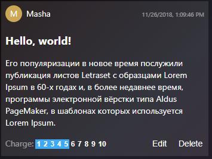

# Общая информация

Необходимо написать SPA web-приложение, позволяющее просматривать список сообщения, создавать новые сообщения и редактировать существующие. Общая структура приложения уже готова, часть компонентов реализована, требуется дописать недостающий код в соответствие с [описанием](#Описание-приложения) и [требованиями](#Требования).

* Примерное время выполнения: `6-12` часов
* Необходимые навыки:
    * знание [Backbone.js](http://backbonejs.org)
    * знание [Marionette.js](https://marionettejs.com/docs/v2.4.7/) (у нас используется старая версия `2.4.7`
    * знакомство с [Epoxy.js](https://codepen.io/anon/pen/aYMxJM) [ссылка на репозиторий](https://github.com/sanperrier/backbone.epoxy) или умение быстро вникать в документацию
    * умение верстать шаблоны с помощью [pug](https://pugjs.org) и [sass](https://sass-lang.com/)
    * умение писать тесты (желательно знакомство с `tape`, у нас используется [blue-tape](https://github.com/spion/blue-tape)
* [Документация API](https://app.swaggerhub.com/apis-docs/b2cm/hiring/1.1#/)

## Настройка окружения:

* `Node.js version >= 11`: для запуска тестов сервера нужна нода, поддерживающая `ES2016` и часть `ES2017`: `async/await`
* `typescript@3.1.6` или свежее (это для написания `d.ts` файлов определений)

## Установка и подготовка

1. Склонировать репозиторий
2. Создаем репозиторий на гитхабе, куда будет опубликовано решение (например, `https://github.com/B2CMessenger/hiring_solution`)
3. Теперь надо в папке с проектом обновить `remotes` для `git`:
   1. `git remote rename origin upstream` - переименовываем `origin` в `upstream`
   2. `git remote set-url --push upstream DISABLE` - запрещаем пуш в `upstream`
   3. `git remote add origin https://github.com/B2CMessenger/hiring_solution.git` - добавляем свой репозиторий как `origin`
4. `git push origin` - пушим в свой репозиторий
5. создаем ветку `solution`, в которой собственно и будет происходить разработка решения
6. `npm install`

## Порядок разработки решения и публикация решения

* Коммиты тестового задания из `upstream` (`https://github.com/B2CMessenger/hiring`) должны быть в истории коммитов решения
* Также надо время от времени проверять обновления `upstream` и либо ребейзить ветку `solution` на HEAD `master` ветки, либо мержить эти обновления
* Желательно, чтобы была видна история коммитов разработки решения, а не один огромный коммит со всем решением
* Для публикации решения надо предоставить нам доступ к репозиторию решения
* Также желательно указать, сколько примерно времени понадобилось для разработки решения

## live-reload и автоматический запуск тестов

Для удобства разработки в `package.json` добавлены скрипты для `live-reload` и автоматического запуска тестов.

`npm run live` - запускает локальный сервер с [API](https://app.swaggerhub.com/apis-docs/b2cm/hiring/1.1#/) с адресом `http://localhost:56668`, запускает `webpack-dev-server` с адресом `http://localhost:56666`, а также автоматически исполняет тесты из папки `test` при изменении исходных кодов приложения и самих тестов

`npm run serve` - отдельный запуск сервера с [API](https://app.swaggerhub.com/apis-docs/b2cm/hiring/1.1#/) с адресом `http://localhost:56668`

## Сборка

`npm run build` - очистит папку `www`, прогонит тесты и соберет бандл и `index.html` в папке `www`

# Описание приложения

Прилоежние представляет из себя `Single Page Application` запускаемое в браузере.

Приложение позволяет просматривать список сообщений, добавлять и редактировать сообщения.


Приложение состоит их одного экрана на котором присутствуют следующие элементы:
* **Хэдер приложения** состоит из
    * *(если пользователь не залогинен)* **Формы логина**: поле ввода **имени** пользователя и **кнопки `Login`**
    * или *(если пользователь залогинен)* **кнопки `Add message`**, **имени текущего пользователя** и **кнопки `Logout`**
* **Область контента** представляет из себя список **сообщений**, полученный с сервера. Каждое **сообщение** состоит из:
    * **Хэдера сообщения** с указанием автора и даты обновления
    * **Заголовка сообщения**
    * **Текста сообщения**
    * **Футера сообщения** с обозначением **заряда** сообщения и кнопками `Edit` и `Delete`
* **Футер сообщения** содержит в себе **редактор сообщения**:
    * **Поле ввода заголовка** сообщения
    * **Поле ввода текста** сообщения
    * **Кнопка `Create` или `Update`**

# Описание проекта

Проект представляет из себя стандартный **пакет** `npm`. Приложение написано на `ES7`, для сборки используется `webpack`. В качестве фреймворка используется `@say2b/framework` - по сути `Marionette.js` + `Epoxy.js` + различные дополнения типа `Model.proxies` и т.п.

## Структура файлов проекта:

* `src` - папка с исходными кодами проекта
    * `index.js` - точка входа
    * `index.html` - шаблон `HTML` для страницы приложения
    * `index.scss` - глобальные стили для приложения
    * `AjaxError.js` - класс-обертка для `Error`, с более удобной сериализацией ошибок `jQuery.ajax()`
    * `settings.js` - модуль с глобальными настройками приложения
    * `App` - папка с исходным кодом класса `App` - подкласс `Marionette.Application`
    * `Editor` - папка с исходным кодом **редактора сообщений**
    * `Message` - папка с исходным кодом **контейнера сообщений**, **модели сообщений** и **виджета сообщения**
    * `User` - папка с исходным кодом **модели пользователя** и **виджета авторизации и отображения пользователя**
    * `utils` - папка со вспомогательными модулями
        * `randomPrettyColor.js` - функция для генерирования цвета: либо по строке, либо рандомный цвет
    * `types` - папка для `d.ts` файлов-описаний
* `test` - папка тестирования
    * `tests` - папка с тестами приложения, тесты для каждого компонента должны быть в файле с названием компонента
        * `acceptance` - папка с приемочными тестами, **этут папку и файлы в ней изменять нельзя!**
        * `acceptance.js` - приемочные тесты, **этот файл изменять нельзя**
        * `index.js` - сюда надо импортировать тесты для компонентов
* `server` - папка с локальным сервером [API](https://app.swaggerhub.com/apis-docs/b2cm/hiring/1.1#/) **Менять сервер для выполнения задания нельзя!**
* `www` - папка, куда будет собрано приложение
* `docs` - используется для хранения материалов для документации
* `webpack` - используется для хранения конфигурации `webpack`

# Требования

## Требования к готовому приложению

* Работоспособность в последней версии `chrome`
* Прохождение всех тестов
* Адаптивность - в конце приложение должно выглядеть как-то вот так:

Мобильные устройства:

   

Планшеты и десктоп:

 

## Общие правила написания кода

* Для описания класса используется `ES6` синтаксис `class`
    * Для указания атрибутов класса следует использовать следующие декораторы (на примере наследования `ItemView`):
        * `@ItemView.options({ ... })` - декоратор для декларативного описания опций
            ```
            @ItemView.options({
                model: Required,
                parentViewModel: Optional
            })
            ```
            служит в первую очередь для **документирования**
        * `@ItemView.events({ 'eventName': (param1, param2) => {} })` - декоратор для декларативного описания событий, которые данный виджет может вызывать
            ```
            @ItemView.event({
                'edit': (messageModel) => {} // событие `edit`, с которым передается `messageModel`
            })
            ```
            служит в первую очередь для **документирования**, не влияет на свойства класса
        * `@ItemView.properties({   })` - декоратор для добавления свойств в прототип класса
            ```
            @ItemView.properties({
                tagName: 'form',
                className: 'user-panel-view',

                ui: {
                    //...
                }
            })
            ```
            служит для **указания свойств класса**, через него в основном и идет *настройка* класса
        * `@ItemView.extendProperties({   })` - аналогично предыдущему декортору, но в отличие от него позволяет расширять свойства, а не перезаписывать их
    * Предпочтителен следущий порядок объвления класса:
        1. `@ItemView.options` - в самом начале указываем с каким **опциями** **создается** экземпляр класса
        2. `@ItemView.events` - потом декларируем, какие события он вызывает
        3. `@ItemView.properties` или `@Model.properties` - потом уже расписывает свойства и параметры:
            * Для виджетов:
                1. `tagName`, `className`, `template`
                2. `childView`, `getChildView`, `childViewOptions`, `viewComparator`, `reorderOnSort`
                3. `ui`
                4. `computeds`, `bindings`
                5. `bindingHandlers`, `bindingFilters`, `bindingSources`
                6. `templateHelpers`
                7. `events`, `triggers`,
                8. `modelEvents`, `collectionEvents`, `childEvents`
            * Для моделей/коллекций:
                1. `model`, `comparator`
                2. `defaults`
                3. `computeds`
                4. `proxies`
        4. После этого уже идет `class Class extends ItemView {`
            1. сначала описываем нестандартные публичные методы типа `markAsRead()`, `increaseCharge()`
            2. потом `constructor` (если нужен нестандартный), 
            3. `initialize()`
            4. `onRender()`, `onAttach()`
            5. стандартные публичные переопределенные методы типа `render()`, `sync()`...
            6. стандартные приватные переопределенные методы типа `_prepareModel()`, `_ensureElement()`
            7. нестанадртные приватные методы `_onModelNameChanged()`, `_renderFooter()`
* Если функция возвращает промис, то предпочтительнее сразу указать ее как `async`
* Все переопределения стандартных полей должны удовлетворять стандартным соглашениям для этого поля. Например, если переопределяем `Model.sync(method, model, options)`, то переопределенный метод обязан вернуть `jqXHR`, обязан вызвать `options.error` или `options.success` с правильными аргументами, а также обязан вызвать событие `request` с правильными параметрами.
* Шаблоны для виджетов должны быть написаны на `pug` и помещены рядом с файлом самого виджета, с тем же названием
* Стили для каждого виджета должны быть написаны на `sass/scss` и помещены рядом с файлом самого виджета, с тем же названием
* Тесты для каждого компонента должны быть в `test/tests/` папке, название файла - название самого компонента

## Компонент `App`

Подкласс `Marionette.Application`. Хранит в себе и управляет `userModel` - модель пользователя, `messageCollection` - коллекция сообщений, `viewModel` - корневая `ViewModel` для всех виджетов. Управляет виджетами `UserPanelView` - виджет панели авторизации пользователя, `MessagesView` - виджет сообщений, `EditorView` - виджет редактора сообщения. Отвечает за общую бизнес-логику приложения: авторизация пользователя, загрузка сообщений, инициализация и отображение редактора сообщений в ответ на запрос создания нового сообщения или редактирование существующего. 

Общая структура и код создания/уничтожения уже готовы.

* `App.onStart()`: 
    * в `header` регионе должен отобразиться виджет `UserPanelView`
    * в `content` регионе должен отобразиться виджет `MessagesView`
    * если в `localStorage` был сохранен `userName`, то должна произойти автоматическая авторизация:
      1. `this.userModel.fetch()` или `this.userModel.save({ name: ... })`
      2. `app.userModel` должна вызывать событие `request`
* `App._onUserModelIsLoggedInChange(...)`: при изменении `App.userModel["isLoggedIn"]`:
    * если пользователь залогинился, то сразу же должны подгрузитья сообщения в `App.messageCollection`, а также в `localStorage["userName"]` должно быть сохранено `App.userModel["name"]` 
    * если пользователь разлогинился, то `localStorage["userName"]` должно быть удалено, а также, если в `footer` регионе отображается редактор, то он должен быть уничтожен (виджет редактора должен быть удален из региона `footer`)
* При появлении события `add` от `UserPanelView` `App` должна отобразить редактор для **нового** сообщения в `footer` регионе.
* При появлении события `edit` от `MessagesView` `App` должна отобразить редактор для **этого сообщения** в `footer` регионе.

### Верстка

Стили для `App` уже написаны и не требуют доработок. Верстка не требуется.

### Тесты

Покрытие тестами не требуется

## Виджет `UserPanelView`

* У этого виджета есть два состояния: **пользователь авторизован**, **пользователь не авторизован**
* виджет в качестве `options` принимает: 
    * `model: UserModel` - обязательный
    * `parentViewModel?: ViewModel` - опциональный, `ViewModel` родителя (используется для иерархической логики `ViewModel["disabled"]` поля)

### Пользователь не авторизован


* Виджет состоит из **поля ввода имени пользователя** и **кнопки `Login`**
* **поле ввода пользователя** должно иметь атрибут `data-js-name-input` (используется в тестах)
* **поле ввода пользователя** имеет плейсхолдер `Enter your name`
* **кнопка `Login`** должна иметь атрибут `data-js-submit` (используется в тестах)
* при нажатии на **кнопку `Login`** или при нажатии `Enter` в **поле ввода имени пользователя** (`submit` событие для формы) должна происходить авторизация пользователя (вызов `this.model.fetch()` или `this.model.save(...)`)
* непосредственно во время исполнения запроса на авторизацию **поле ввода** и **кнопка** должны быть **заблокированы**
* после успешного выполнения запроса `UserModel`, **приложение** и **виджет** переходят в состояние авторизованного пользователя

### Пользователь авторизован


* Виджет состоит из **кнопки `Add message`**, **надписи с имененм пользователя** и **кнопки `Logout`**
* **кнопка `Add message`** должна иметь атрибут `data-js-add` (используется в тестах)
* при нажатии на **кнопку `Add Message`** `UserPanelView` должен создать событие `add(void)`, и соот-но, в **футере** приложения должен отобразиться **редактор нового сообщения**. Следует учесть, что, если редактор уже был открыт в режиме создания нового сообщения, то его не следует пересоздавать
* **надпись с имененм пользователя** должна иметь атрибут `data-js-user-name` (используется в тестах) и отображать имя текущего пользователя.
* **кнопка `Logout`** должна иметь атрибут `data-js-submit` (используется в тестах)
* при нажатии на **кнопку `Logout`** модель `UserModel` должна переходить в неавторизованное состояние: `UserModel["name"]` и `UserModel["token"]` должны очищаться, соот-но **приложение** и **виджет** переходят в состояние неавторизованного пользователя

### Верстка

Нужно будет сверстать шаблон для этого виджета, а также прописать стили.
Вот пара тонких моментов:
* Если имя пользователя не помещается на экране, то оно должно быть обрезано с использованием `text-overflow: ellipsis`
* Кнопка `Add message` должна быть у левого края, а поле ввода, имя пользователя и кнопка `Login/Logout` должны быть у правого края
* Все элементы должны быть выровнены по вертикали по `baseline`

### Тесты

Покрытие тестами не требуется. Но желательно.

## Модель `UserModel`

Модель пользователя. Содержит в себе `name` - имя пользователя, `token` - токен авторизации, `isLoggedIn` - вычислимое(`computed` [см. Epoxy.js computeds](https://codepen.io/anon/pen/aYMxJM)) поле статуса авторизации пользователя.

Для этой модели необходимо реализовать методы синхронизации с [API](https://app.swaggerhub.com/apis-docs/b2cm/hiring/1.1#/User)

### Тесты

* Необходимо покрыть тестами `[isLoggedIn]` поле
* Методы `fetch()`, `save()`, `destroy()`

## Виджет `MessagesView`

Виджет списка сообщений.

* Сообщения должны быть отсортированы по `created_at`
* При получении события `edit@MessageView` виджет должен отправить событие `edit@MessagesView` приложению, чтобы оно могло открыть редактор для существующего сообщения
* Виджет в качестве `options` принимает: 
    * `collection: MessageCollection` - обязательный
    * `parentViewModel?: ViewModel` - опциональный, `ViewModel` родителя (используется для иерархической логики `ViewModel["disabled"]` поля)

### Тесты

Покрытие тестами не требуется. Но желательно.

## Коллекция `MessageCollection`

Коллекция моделей `MessageModel`.

Для этой коллекции необходимо реализовать методы синхронизации с [API](https://app.swaggerhub.com/apis-docs/b2cm/hiring/1.1#/Messages)

### Тесты

* Методы `fetch()`, `create()`

## Виджет `MessageView`



* Виджет должен иметь атрибут `data-js-message` равный `id` модели (используется в тестах)
* Виджет в качестве `options` принимает: 
    * `model: MessageModel` - обязательный
    * `userModel: UserModel` - обязательный
    * `parentViewModel?: ViewModel` - опциональный, `ViewModel` родителя (используется для иерархической логики `ViewModel["disabled"]` поля)

### Header

Заголовок виджета сообщения должен содержать в себе следующие элементы:

* Аватарка пользователя, круг с фоном с цветом, соответствующим `author` строке (используется `utils/randomPrettyColor`), в центре - первая буква имени автора
* Элемент с именем пользователя должен иметь атрибут `data-js-author` (используется в тестах)
* Дата последнего изменения в формате локали браузера пользователя, элемент должен иметь атрибут `data-js-date` (используется в тестах). При изменении поля `updated_at` должно обновляться только содержимое этого элемента.

### Content

Контентная область сообщения. Состоит из **темы** и **текста** сообщения

* Элемент с **темой** сообщения должен иметь атрибут `data-js-subject`
* Элемент с **текстом** сообщения должен иметь атрибут `data-js-text`
* При изменении в модели полей `subject` и `text`, виджет не должен полностью перерисовываться через `render()`, только сами элементы должны быть обновлены

### Footer

Подвал сообщения. Состоит из **заряда** сообщения и кнопок **`Edit`** и **`Delete`**

* **заряд** сообщения отображается в виде ряда кнопок от `1` до `10`. Каждая кнопка должна иметь атрибут `data-js-charge`, значение которого равно соответствующему заряду. При нажатии на кнопку должны происходить запросы на изменени заряда до соответствующего значения. На время **выполнения запросов** виджет сообщения должен **блокироваться** (блокируются все активные элементы виджета).
* При изменении в модели поля `charge`, виджет не должен полностью перерисовываться через `render()`, должно быть обновление только виджета **заряда**
* **кнопка `Edit`**, должна иметь атрибут `data-js-edit`. Отображается только в случае, если **залогиненный пользователь** является **автором** сообщения, также она должна быть либо удалена из `DOM`, либо заблокирована, если **пользователь** не является автором сообщения.
* при нажатии на **кнопку `Edit`** в футере приложения должен отобразиться **редактор этого сообщения**. Следует учесть, что если редактор уже открыт для этого сообщения, то его не стоит пересоздавать или перезагружать.
* **кнопка `Delete`**, должна иметь атрибут `data-js-delete`. Отображается только в случае, если **залогиненный пользователь** является **автором** сообщения, также она должна быть либо удалена из `DOM`, либо заблокирована, если **пользователь не является автором** сообщения.
* при нажатии на **кнопку `Delete`** сообщение должно быть удалено. Следует учесть, что, если у сообщения ненулевой **заряд**, то перед его удалением необходимо привести его к нулю, для пользователя же эта цепочка запросов должна выглядеть одним непрерывным запросом, на время которого **виджет сообщения** должен быть **заблокирован**
* при изменении статуса авторизации пользователя **кнопки `Edit` и `Delete`** должны быть обновлены, но при этом не должно происходить полной перерисовки виджета сообщения

### Верстка

Нужно будет сверстать шаблон для этого виджета, а также прописать стили.
* Если имя пользователя не помещается на экране, то оно должно быть обрезано с использованием `text-overflow: ellipsis`

### Тесты

Покрытие тестами не требуется. Но желательно.

## Модель `MessageModel`

Модель сообщения. 

Для этой коллекции необходимо реализовать методы синхронизации с [API](https://app.swaggerhub.com/apis-docs/b2cm/hiring/1.1#/Messages)

* методы изменения заряда должны быть представлены функциями:
    * `async increaseCharge()` - асинхронное увеличение **заряда** на `1`
    * `async decreaseCharge()` - асинхронное уменьшение **заряда** на `1`
    * `async setCharge(charge)` - асинхронное приведение **заряда** к **указанному значению**

### Тесты

* `fetch()`
* `save()`
* `destroy()`
* `increaseCharge()`
* `decreaseCharge()`
* `setCharge()`

## Виджет `EditorView`


Виджет **редактора** нового/существующего сообщения. Состоит из поля ввода **темы сообщения**, поля ввода **текста сообщения** и **кнопки `Create/Update`**

* поле ввода **темы сообщения** должно иметь атрибут `data-js-subject`
* текстовое поле ввода **текста сообщения** должно иметь атрибут `data-js-text`
* при нажатии на **кнопку `Create/Update`**:
  *  в случае нового сообщения должен отправиться **запрос на создание нового сообщения**, после этого это сообщение должно быть добавлено в **список всех сообщений**
  *  в случае редактирования существующего должен отправиться запрос на изменение сообщения и эти изменения должны быть отражены в **списке всех сообщений**
  *  в обоих случаях на время запроса редактор должен быть **заблокирован** (через атрибут `disabled` для полей ввода и кнопок)
* после добавления нового сообщения список должен прокрутиться до него
* если пользователь разлогинился, то редактор должен быть скрыт
* виджет в качестве `options` принимает: 
    * `model: MessageModel` - обязательный
    * `parentViewModel?: ViewModel` - опциональный, `ViewModel` родителя (используется для иерархической логики `ViewModel["disabled"]` поля)
  
### Тесты

Покрытие тестами не требуется. Но желательно.

# Вспомогательная информация по фреймворку `@say2b/backbone`

Разберем самые частоиспользуемые возможности `@say2b/backbone` на примере виджета `CustomView`:

Условимся, что модель, передаваемая в виджет может иметь следующие поля:
* `header: string|null|undefined` - некий заголовок
* `text: string|null|undefined` - некий текст
* `count: integer` - некое значение

Т.к. используется новый синтаксис определения классов `ES6`, то старый подход через `ItemView.extend({...})` является устаревшим.
Свойства прототипа класса стоит задавать через декораторы, которые предоставляются базовыми классами фреймворка:

```js
/* Позволяет задекларировать опции, которые надо передавать в конструктор виджета.
   Устанавливает `Class.prototype.options` */
@ItemView.options({
    /* Используется `Required` константа, которая на самом деле равна `null`, 
       позволяет отметить опцию как  обязательную.
       Указывает, что виджету необходимо передать `model` */
    model: Required,
    /* Используется `Optional` константа, которая на самом деле равна `null`, 
       позволяет отметить опцию как необязательную.
       Указывает, что виджету можно передать `parentViewModel` */
    parentViewModel: Optional
})

/* Позволяет задекларировать нестандартные события, которые вызываются виджетом.
   На данный момент не имеет никакого эффекта, используется для документирования */
@ItemView.events({
    /* Декларируем событие `caption:click`, в аргументы которого передается строка 
       `caption` и объект события `e` */
    'caption:click': (caption, e) => { }
})

/* Самый многофункциональный декоратор. Напрямую расширяет `Class.prototype` */
@ItemView.properties({
    /* Стандартные свойства для Marionette.ItemView */
    tagName: 'div',
    template,
    className: 'custom-view view',

    ui: {
        input: '[data-js-input]',
        caption: '[data-js-caption]'
    },

    /* Ко всем клссам `*View` из фреймворка уже примешан `Epoxy.View`.
       Это позволяет пользоваться всеми возможностями `Epoxy.View`.
       Декларируем вычисляемые значения виджета на основе полей из модели.
       Эти вычисляемые значения можно использовать в биндингах наряду с полями модели.
       Подробнее: см. документацию `Backbone.Epoxy` */
    computeds: {
        /* Создаем новое `read-only` вычисляемое значение `c_CaptionText`, которое
           автоматически обновляется, если меняются поля `header` и `text` модели. */
        c_CaptionText: {
            deps: ['header', 'text'],
            get: (header, text) => (header ? header + ' ' : '') + (text ? '\n' + text : '')
        },

        /* Создаем новое `read-write` вычисляемое значение `c_Value`, которое по сути 
           проксирует и нормализует значение поля `value` из модели и нормализует 
           значение переданное из поля ввода. */
        c_Value: {
            deps: ['value'],
            /* Обработчик `Context -> HTMLElement` */
            get: value => value || null,
            /* Т.к. данное значение будет использовано в двухстороннем биндинге, 
               то необходимо предоставить обработчик для `HTMLElement -> Context` сценария*/
            set(val) {
                /* Фильтруем, нормализуем и записываем в модель */
                this.model.set(Number(val) || null)
            }
        }
    },

    /* Дальше декларируем сами биндинги в формате: 
       `selector`:`bindingsListSerialized` */
    bindings: {
        /* Здесь используется специальный селектор `:el`, который позволяет создать
           биндинги к самому(корневому) элементу виджета `this.el`.
           Используется хэндлер `classes`, который позволяет добавлять или убирать
           классы в зависимости от переданного значения (точнее, от того, является ли
           переданное значение `truthy`) */
        ':el': 'classes:{"has-header":header}',

        /* Здесь используется специальный селектор `@ui.input`, который позволяет создать
           биндинги элементу из `ui` хэша виджета.
           Используется `read-write` хэндлер `value`, который устанавливает двухстороннею 
           связь между значением `input` и `c_Value`: если `c_Value` изменится, то значение 
           `input` будет обновлено, если значение `input` изменится в следствие 
           пользовательского ввода, то `c_Value` будет обновлено.
           Используется `read-only` хэндлер `disabled`, который позволяет добавлять или убирать
           атрибут `disabled` для поля ввода в зависимости от переданного значения 
           (точнее, от того, является ли переданное значение `truthy`).
           Используется `read-only` хэндлер `attr`, который позволяет добавлять или убирать
           атрибуты элемента в зависимости от переданного значения 
           (точнее, от того, является ли переданное значение `truthy`) */
        '@ui.input': 'value:c_Value,disabled:disabled,attr:{readonly:disabled}',

        /* Используется `read-only` хэндлер `text`, который устанавливает содержимое 
        `HTMLElement` в строку `c_CaptionText` */
        '@ui.caption': 'text:c_CaptionText',
    },

    /* Стандартное свойство `events` для `Marionette.View` */
    events: {
        'click @ui.caption'(e) {
            /* `this.getBinding() позволяет получить текущее значение из контекста биндингов`*/
            this.trigger('caption:click', this.getBinding('c_CaptionText'), e);
        },
    },

    /* Стандартное свойство `modelEvents` для `Marionette.View` */
    modelEvents: {
        'request'() {
            this.viewModel.set({ disabled: true });
        },
        'sync'() {
            this.viewModel.set({ disabled: false });
        },
        'error'() {
            this.viewModel.set({ disabled: false });
        }
    }
})

class CustomView extends ItemView {
    initialize() {
        /* Для всех `*View` из фреймворка можно задать специальную дополнительную модель для
           хранения состояния самого виджета. Для этого используется специальный класс `ViewModel`.
           Отличается от обычной модели `Model` тем, что всегда содержит поля `disabled`, `enabled`,
           а также можно задать `parentViewModel` и тогда `disabled`, `enabled` будут учитывать 
           состояние родительской модели: 
             Если родительская модель `disabled == true`, то и сама модель `disabled === true`,
             Если родительская модель `disabled == false`, то сама модель `disabled`, если ей выставить 
               `set({ disabled:true })`.
            Удобно, когда надо выстроить иерархию блокирования виджета - блокируем родителя, и все дети
            будут заблокированы. Разблокируем родителя и те дети, которые были до этого разблокированы, 
            будут разблокированы, а те, которые были заблокированы, останутся заблокироваными. */
        this.viewModel = new ViewModel({
            parentViewModel: this.options.parentViewModel || null
        });
    }

    onDestroy() {
        this.viewModel.destroy();
    }
}
```

Более подробная документация доступна по следующим ссылкам:
* [Backbone.js](http://backbonejs.org)
* [Marionette.js](https://marionettejs.com/docs/v2.4.7/)
* [Epoxy.js](https://codepen.io/anon/pen/aYMxJM)

# Вопросы/ответы

> Почему у сервера такое странное API (PUT, наряду с, legacy)?

Это API было разработано специально, чтобы проверить, как кандидиат справляется с доработкой стандартного механизма `Backbone.sync` под нестандартное/кривое/устаревшее API

> Насколько важно решить "самым правильным с точки зрения составителя способом"?

Код можно будет защищать. Единственного правильного варианта нету. Есть "ИМХО, самое правильное решение". Но в первую очередь важна внутрення логика решения, непротиворечивость и соответствие требованиям. Если кандидат предоставит свое оригинальное решение, которое объективно не хуже и/или сможет обосновать почему и зачем, то никаких проблем не будет.

> Нету аналога `setCharge()` на сервере, только какие-то неудобные `increase/decrease`, почему?

Это часть задачи, так задумано. Является проверкой умения работать с асинхронной логикой.

> Можно ли доработать сервер, чтобы было удобнее решать задание?

Менять функциональную часть сервера категорически нельзя. Относитесь к нему как к удаленному ресурсу, надо которым у вас не контроля.


